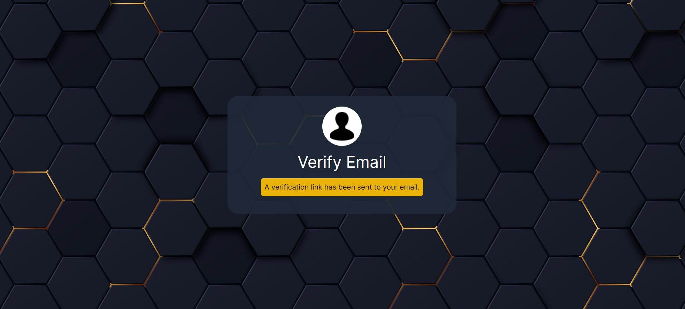
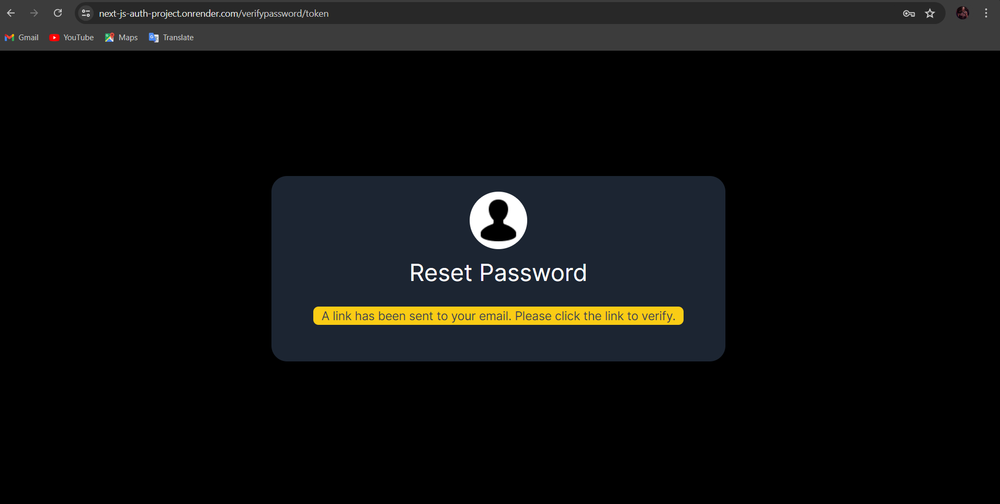
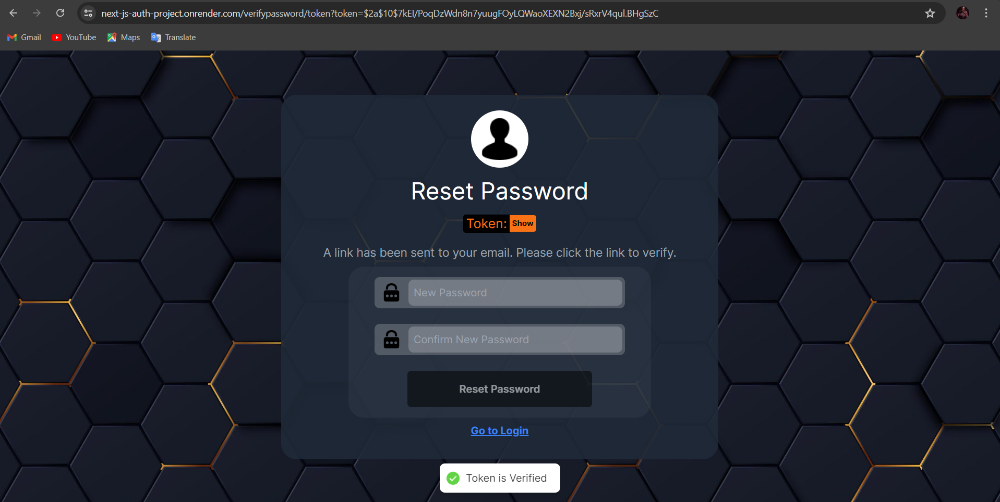

# Open Chat

Open Chat is a real-time messaging application that enables seamless communication between users. Built with modern web technologies, it offers a smooth and responsive user experience across different devices.

## Live Demo

Check out the live demo [here](https://next-js-auth-project.onrender.com/).

## Live Images











## Getting Started

Follow these steps to set up the project on your local machine:

1. **Fork the Repository:**
   - Click on the "Fork" button at the top right corner of this repository's GitHub page.

2. **Clone the Forked Repository:**
   ```bash
git clone https://github.com/VrajVyas11/Next_JS_AUTH_Project.git

3. **Navigate to the Project Directory:**
     cd Next_JS_AUTH_Project

4.**Install Dependencies:
       Ensure you have Node.js and npm installed, then run: **

         npm install

5. **Set Up Environment Variables:
Create a .env file in the root directory and add the necessary environment variables as specified in .FakeENV.**


6.**Start the Development Server:**
   npm start

7.**Open Your Browser:
Navigate to http://localhost:3000 to see the application running.**


